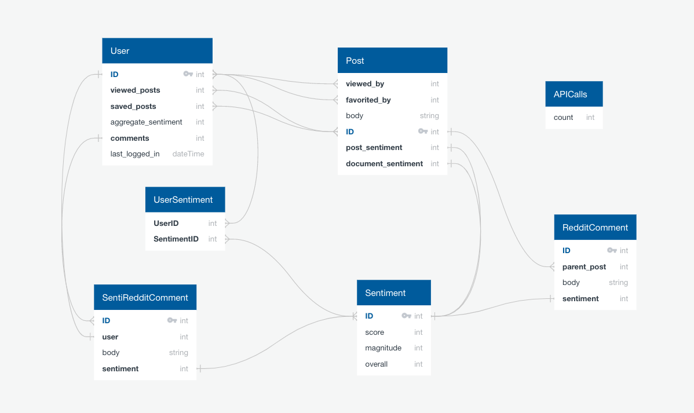
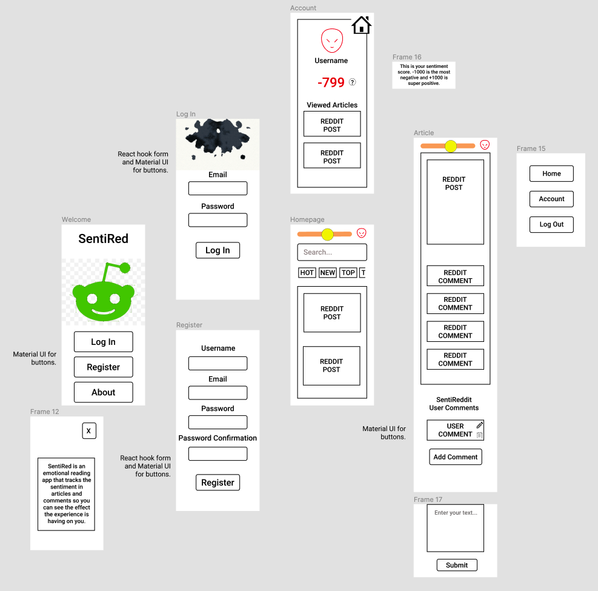

 GENERAL ASSEMBLY — SOFTWARE ENGINEERING IMMERSIVE 2020

# SentiRed

Most popular news algorithms today offer up news that triggers an emotional response. This is true of print and online media. Who among us has never read an article that made them angry, or happy? What if there was a way to measure the negativity or positivity you'd been exposed to so you had visual cues for your emotions? These questions led [Kianna Love](https://github.com/akirakianna) and I to build [SentiRed](https://sentired.herokuapp.com), an app that uses language sentiment analysis to measure the degree of positivity or negativity to which a user is exposed on a popular social news website. The results are displayed via emotional UI changes (i.e. colour, font and border radius) rendered in real time.

[Try it out.](https://sentired.herokuapp.com)

We would recommend registering for your own account as your sentiment will start at neutral, which makes for a better experience.

## Table of Contents

1. [Brief](https://github.com/alicnik/sentired#brief)
2. [Approach](https://github.com/alicnik/sentired#brief)
   - [MVP](https://github.com/alicnik/sentired#mvp)
   - [Technologies](https://github.com/alicnik/sentired#technologies)
   - [Methodologies](https://github.com/alicnik/sentired#methodologies)
3. [Planning](https://github.com/alicnik/sentired#planning)
   - [Back End](https://github.com/alicnik/sentired#back-end)
   - [Front End](https://github.com/alicnik/sentired#front-end)
4. [Responsibilities](https://github.com/alicnik/sentired#responsibilities)
5. [Challenges](https://github.com/alicnik/sentired#challenges)
6. [Key Learnings](https://github.com/alicnik/sentired#key-learnings)
7. [Conclusions](https://github.com/alicnik/sentired#conclusions)

## Brief

Create a full-stack application with its own front end and back end. Use a Python Flask API with a REST framework to serve data from a Postgres database. Consume the API with a React front end. Create a complete product with multiple relationships and CRUD functionality. Implement thoughtful user stories and have a visually impressive design. Deploy online so it's publicly accessible.

## Approach

### MVP

We were keen to do justice to this idea so set an MVP target that incorporated all our ideas, namely:

- Login and register functionality
- Consume Reddit API to display hot/new/rising/etc stories on homepage, along with search
- Clicking a post would trigger the language sentiment analysis and store the post with its comments and sentiment score in our database
- The program would track the sentiment to which the user had been exposed and aggregate that sentiment, placing the user in a bracket, i.e. neutral, happy, sad, ecstatic, or angry.
- The user's sentiment score would trigger changes in the UI as the user crossed the bracket boundaries into happy/sad/etc.
- A "progress bar" of sorts would display the user's sentiment to gamify the experience in real time.

We scaled back on some of the finer UI elements, such as animation and transitioning, leaving those as stretch goals.

### Technologies

On top of the brief requirements, we were keen to work further with some libraries we had previously used and also to introduce some new ones.

#### Required

- PostgreSQL
- Python
- Flask
- Flask SQLAlchemy
- Marshmallow
- React
- React Router
- Node.js

#### Additional

- [Material UI](https://github.com/mui-org/material-ui)
- [Styled Components](https://github.com/styled-components/styled-components)
- [React Hook Form](https://github.com/react-hook-form/react-hook-form)
- [Yup](https://github.com/jquense/yup)
- [Moment](https://github.com/moment/moment)
- [PRAW](https://github.com/praw-dev/praw)

### Methodologies

- Pair program, either using VS Code Live Share or sharing screen and adopting a driver-navigator style;
- Avoid repetition, keep it DRY, and favour simplicity, per KISS
- Write _legible_ code and eschew clever snippets in favour of more readable code, if applicable
- Ensure that there is a Single Source of Truth for any one concern

N.B. Pair programming was not a requirement, but we were interested to see what it would be like in the context of a full-stack application.

## Planning

We adopted the Model-View Controller (MVC) framework to separate our concerns.

### Back End

We devoted a good portion of our initial planning to developing our models and relationships.

#### Entity Relationship Diagram



#### The Sentiment Model:

Since the sentiment analysis was the major component of the app, we concluded it merited its own model. This would also adhere to the Single Source of Truth approach and give us better insight into SQL relationships.

``` python
class Sentiment(db.Model, BaseModel):

    __tablename__ = 'sentiments'

    polarity = db.Column(db.Float, nullable=False)
    score = db.Column(db.Float, nullable=False)
    magnitude = db.Column(db.Float, nullable=False)

    sentireddit_comment_id = db.Column(db.Integer, db.ForeignKey('sentireddit_comments.id', ondelete='SET NULL'))
    reddit_comment_id = db.Column(db.Integer, db.ForeignKey('reddit_comments.id'))
    post_id = db.Column(db.Integer, db.ForeignKey('posts.id'))
```

Since we wanted to faithfully track all sentiments to which a user had been exposed, deletion of a user comment on our platform (termed a `sentiredd_comment` during development) should not delete the associated sentiment, as that would remove it from a user's sentiment history. Accordingly, we used `SET NULL` instead of `CASCADE` for `ondelete` behaviour.

#### Separation of Models and Schemas

During my reading into Flask SQLAlchemy and Marshmallow, I came across an interesting issue with imports, described [here](https://github.com/marshmallow-code/flask-marshmallow/issues/143). Essentially, Marshmallow schemas, when imported, instantiate Flask SQLAlchemy models. (Importing a model on its own does not exhibit this behaviour.) This can create circular references and result in errors. I was therefore keen to ensure we separated our model and schema modules.

#### Single Reddit Post Controller

Perhaps the most thorough logic in the back end was this controller, which checks for the article in our own database, fetching it from Reddit if it is not found.

``` python
@router.route('/posts/<reddit_id>', methods=['GET'])
@secure_route
def get_one(reddit_id):
    post = Post.query.filter_by(reddit_id=reddit_id).first()
    user = User.query.get(g.current_user.id)
    if not post:
        submission = reddit.request('GET', f'https://oauth.reddit.com/comments/{reddit_id}', {'limit': 3})
        data = submission[0]['data']['children'][0]['data']
        new_post = Post(
            reddit_id=data['id'],
            title=data['title'],
            body=data['selftext'],
            subreddit=data['subreddit'],
            reddit_author=data['author'],
            reddit_created_at=datetime.fromtimestamp(data['created_utc'])
        )

        if re.search('\.(png|gif|jpe?g|svg)$', data['url']):
            new_post.media = data['url']
        elif 'media' in data and data['media'] and 'reddit_video' in data['media']:
            new_post.media = data['media']['reddit_video']['fallback_url']
        elif 'preview' in data and data['preview'] and 'reddit_video_preview' in data['preview']:
            new_post.media = data['preview']['reddit_video_preview']['fallback_url']
        elif 'thumbnail' in data and data['thumbnail'] and data['thumbnail'] != 'self' and data['thumbnail'] != 'spoiler' and data['thumbnail'] != 'default':
            new_post.media = data['thumbnail']
        else:
            new_post.media = random_cage()

        for comment in submission[1]['data']['children']:
            if 'body' not in comment['data']:
                continue
            new_reddit_comment = RedditComment(
                body=comment['data']['body'],
                subreddit=comment['data']['subreddit'],
                reddit_created_at=datetime.fromtimestamp(comment['data']['created_utc']),
                reddit_author=comment['data']['author']
            )
            new_reddit_comment.save()
            new_post.reddit_comments.append(new_reddit_comment)

        new_post.save()
        user.viewed_posts.append(new_post)
        user.save()
        return post_schema.jsonify(new_post)

    user.viewed_posts.append(post)
    user.user_sentiments.append(post.sentiment)
    if post.reddit_comments:
        for comment in post.reddit_comments:
            user.user_sentiments.append(comment.sentiment)
    if post.sentireddit_comments:
        for comment in post.sentireddit_comments:
            user.user_sentiments.append(comment.sentiment)
    calculate_user_aggregate_sentiment(user)
    user.save()
    return post_schema.jsonify(post), 200
```

As we wanted to track all sentiments a user had been exposed to, this was a secure route that required the user to be logged in. If the post was not already in our database, we used the PRAW library `.request` method, which proved more reliable with regard to authentication and sidestepped the need to refresh the token for the Reddit API, to obtain the post contents and its comments. (Conveniently this information exists on one endpoint on the Reddit API.)

We discovered that there was some inconsistency in where media was stored in the API response. The majority of the time, if there was a picture, it was on the `url` key, however the `url` key value could also be a link to a news story. From there, various other options could be extant on the response, but the inconsistency required a number of fallbacks. As a final fallback, instead of a generic placeholder, we used the excellent [PlaceCage API](https://www.placecage.com/) to provide media where none existed.

The response time for the Reddit API could be over 2 seconds, so we determined that for reasons of UX it would be best to do the Google Natural Language API calls in a separate route. Accordingly, sentiment is only added to the user if the post is already in the database.

#### Google Natural Language API Fetch

Originally, I used the Google Natural Language Python library for a function to obtain the sentiment score of a given text. After some challenges (_infra_ [Challenges](https://github.com/alicnik/sentired#challenges) for more details) with the library, I rewrote the function using the inbuilt Python requests library.

``` python
api_key = os.environ['GOOGLE_API_KEY']

def fetch_sentiment(text):
    url = f'https://language.googleapis.com/v1beta2/documents:analyzeSentiment?key={api_key}'
    body = {
        "document": {
            "type": "PLAIN_TEXT",
            "language": "EN",
                    "content": text
        },
        "encodingType": "UTF8"
    }
    response = requests.post(url, json=body)
    sentiment = json.loads(response.text)
    calls = ApiCalls.query.get(1)
    calls.count += 1
    calls.save()
    return sentiment['documentSentiment']
```

This function could be reused in our controllers to facilitate obtaining the relevant sentiment scoring. To aid in rate limiting calls to Google's API, which has a monthly limit on it, all analyses were tracked in a separate ApiCalls table.

#### Sentiment Analysis Controller

As mentioned above, this separated from the Reddit post fetch due to the time it took for both responses to come and the impact this would have on UX.

``` python
@router.route('/posts/<reddit_id>/sentiment', methods=['GET'])
@secure_route
def analyse_post_and_comments(reddit_id):
    post = Post.query.filter_by(reddit_id=reddit_id).first()
    user = User.query.get(g.current_user.id)
    if not post:
        return jsonify({'message': 'Could not return post'}), 404

    sentiment_instance = Sentiment(
        polarity=language_sentiment['score'],
        magnitude=language_sentiment['magnitude'],
        score=(language_sentiment['score'] * language_sentiment['magnitude']),
        post_id=post.id
    )
    sentiment_instance.save()
    user.user_sentiments.append(sentiment_instance)

    for comment in post.reddit_comments:
        calls = ApiCalls.query.get(1)
        if calls.count > 4500:
            break
        if comment.sentiment:
            continue
        language_sentiment = fetch_sentiment(comment.body)
        comment_sentiment_instance = Sentiment(
            polarity=language_sentiment['score'],
            magnitude=language_sentiment['magnitude'],
            score=(language_sentiment['score'] * language_sentiment['magnitude']),
            reddit_comment_id=comment.id
        )
        comment_sentiment_instance.save()
        user.user_sentiments.append(comment_sentiment_instance)

    calculate_user_aggregate_sentiment(user)
    user.save()
    post.save()
    return post_schema.jsonify(post), 200
```

This route analyses a Reddit post's sentiment and the sentiment of its comments. The post sentiment and the sentiment of each of its comments is then saved to the current user.

### Front End

The front end was developed using React, Material UI, styled-components and react-hook-forms for the most part, according to the following wireframe:

#### UX Wireframe



[Prototype walkthrough](https://www.figma.com/proto/qMXz70ReXQMZww9bNPr2C8/SentiRed-Wireframe?node-id=1%3A52&viewport=611%2C495%2C0.24284692108631134&scaling=scale-down)

#### Register Form

An example of the marriage of various libraries is perhaps best demonstrated in the Register component, which is a React functional component that uses Material UI for the text fields as well as styled components for the form container. The form logic itself is controlled via react-hook-forms using a Yup validation schema.

``` javascript
const schema = Yup.object().shape({
  username: Yup.string().required('Please enter a username'),
  email: Yup.string().email('Please enter a valid email address').required('Please enter your email'),
  password: Yup.string().required('Please enter a password')
    .min(8, 'Password must be at least 8 characters')
    .matches(/[A-Z]/, 'Password must contain at least one uppercase letter' )
    .matches(/[a-z]/, 'Password must contain at least one lowercase letter')
    .matches(/[0-9]/, 'Password must contain at least one number'),
  password_confirmation: Yup.string().required('Please confirm your password')
    .oneOf([Yup.ref('password'), null], 'Passwords must match')
})

const StyledForm = styled.form`
  display: flex;
  flex-direction: column;
  align-items: center;
  min-height: 60vh;
  min-width: 300px;
  justify-content: space-around;
  position: absolute;
  top: 60%;
  left: 50%;
  transform: translate(-50%, -50%);
  color: white;
`

const Register = () => {

  const history = useHistory()
  const { register, handleSubmit, errors, setError } = useForm({
    resolver: yupResolver(schema),
    criteriaMode: 'all'
  })

  const onSubmit = (data) => {
    axios.post('/api/register', data)
      .then(() => history.push('/login'))
      .catch(err => {
        Object.entries(err.response.data.errors).forEach(([errorField, errorMessage]) => {
          setError(errorField, { message: errorMessage })
        })
      })
  }

  return (
    <main>
      <h2 style={{
        fontSize: '4rem',
        color: 'white',
        margin: '0 auto',
        textAlign: 'center',
        lineHeight: '30vh',
        letterSpacing: '0.1rem',
        fontFamily: '"Nanum Myeongjo", serif'
      }}>REGISTER</h2>
      <StyledForm onSubmit={handleSubmit(onSubmit)} >
        <TextField
          name="username"
          inputRef={register}
          label="Username"
          type="text"
          variant="outlined"
        />
        <span>{errors.username?.message}</span>
        <TextField
          name="email"
          inputRef={register}
          label="Email"
          type="email"
          variant="outlined"
        />
        <span>{errors.email?.message}</span>
        <TextField
          name="password"
          inputRef={register}
          label="Password"
          type="password"
          variant="outlined"
        />
        <span>{errors.password?.message}</span>
        <TextField
          name="password_confirmation"
          inputRef={register}
          label="Password confirmation"
          type="password"
          variant="outlined"
        />
        <span>{errors.password_confirmation?.message}</span>
        <Button type="submit" variant="outlined">Submit</Button>
      </StyledForm>
      <BackgroundVideo />
    </main>
  )

}
```

It also depends upon custom overrides of the Material UI Theme which are contained in FormContext.js:

``` javascript
import React from 'react'
import { createMuiTheme, MuiThemeProvider } from '@material-ui/core/styles'

export const FormMaterialProvider = ({ children }) => {

  const formTheme = createMuiTheme({
    overrides: {
      MuiOutlinedInput: {
        notchedOutline: {
          borderColor: 'white !important',
          mixBlendMode: 'difference',
          zIndex: 0
        },
        input: {
          color: 'white',
          mixBlendMode: 'difference',
          fontFamily: '"Nanum Myeongjo", serif'
        }
      },
      MuiFormControl: {
        root: {
          borderColor: 'white',
          mixBlendMode: 'difference',
          minWidth: 250,
          fontFamily: '"Nanum Myeongjo", serif'
        }
      },
      MuiFormLabel: {
        root: {
          color: 'white !important',
          mixBlendMode: 'difference',
          fontFamily: '"Nanum Myeongjo", serif'
        }
      },
      MuiInputLabel: {
        shrink: {
          borderColor: 'white !important',
          mixBlendMode: 'difference',
          color: 'white'

        }
      },
      MuiButton: {
        root: {
          color: 'white',
          fontFamily: '"Nanum Myeongjo", serif',
          padding: '1rem'
        },
        outlined: {
          padding: '0.6rem 1.6rem',
          fontSize: '1rem',
          borderColor: 'white'
        }
      }
    }
  })

  return (
    <MuiThemeProvider theme={formTheme}>
      {children}
    </MuiThemeProvider>
  )
}
```

Since the overrides for the form were designed to allow for used of mix-blend-mode CSS property, a second set of custom overrides was required for the rest of the site, resulting in nested override providers in our App.js:

``` javascript
<FormMaterialProvider>
	<Route exact path="/register" component={Register} />
	<Route exact path="/login" component={Login} />
	<MaterialProvider>
	  <Route exact path="/home" component={Home} />
	  <Route exact path="/account" component={Account} />
	  <Route path="/posts/:redditId" component={Post} />
	</MaterialProvider>
</FormMaterialProvider>
```

#### Home Page

Since the response times from the Reddit API varied and we did not want this to impact the UX, we implemented loading placeholders using the Material UI skeleton component:

``` javascript
import React from 'react'
import Card from '@material-ui/core/Card'
import CardHeader from '@material-ui/core/CardHeader'
import CardContent from '@material-ui/core/CardContent'
import Skeleton from '@material-ui/lab/Skeleton'

const LoadingCard = () => (
  <Card>
    <CardHeader
      avatar={<Skeleton variant="circle" width={40} height={40} />}
      title={<Skeleton height={10} width="60%" style={{ marginBottom: 6 }} />}
      subheader={<Skeleton height={10} width="60%" style={{ marginBottom: 6 }} />}
    />
    <Skeleton variant="rect" width="40%" height="150px" style={{ float: 'left', marginRight: 10 }}/>
    <CardContent>
      {Array(4).fill(0).map((el, i) => <Skeleton key={i} height={15} width="50%" style={{ marginBottom: 10, overflow: 'hidden' }} />)}
    </CardContent>
  </Card>
)

export default LoadingCard
```

The skeleton layout was designed to emulate the layout of the populated cards. Once the response is received, cards are populated for the user to browse and choose. There is also a search function and a carousel of categories (hot, new, rising, etc.) available. At this point, no language sentiment analysis is performed, partly due to the fact that the user has no choice in what they see at this point, but also to the API calls cap of the Google Natural Language API. When a user clicks on a story, they are taken to the Post component.

#### Post

The post component is the beating heart of the app and is where language sentiment analysis is performed. To minimise UX interference, API calls are chained:

``` javascript
useEffect(() => {
    axios.get(`/api/posts/${redditId}`, { headers: { 'Authorization': `Bearer ${token}` } })
      .then(initialResponse => {
        setPostWithComments(initialResponse.data)
        return initialResponse
      })
      .then(initialResponse => {
        if (initialResponse.data.reddit_author_avatar && initialResponse.data.reddit_comments.every(comment => comment.reddit_author_avatar)) return initialResponse
        axios.get(`/api/posts/${redditId}/avatars`, { headers: { 'Authorization': `Bearer ${token}` } })
          .then(avatarResponse => {
            setPostWithComments(avatarResponse.data)
            return initialResponse
          })
          .catch(err => console.log(err))
        return initialResponse
      })
      .then(initialResponse => {
        if (initialResponse.data.sentiment && initialResponse.data.reddit_comments.every(comment => comment.sentiment)) return
        axios.get(`api/posts/${redditId}/sentiment`, { headers: { 'Authorization': `Bearer ${token}` } })
          .then(sentimentResponse => setPostWithComments(sentimentResponse.data))
          .then(() => updateUser())
          .catch(err => console.log(err))
      })
      .then(() => updateUser())
      .catch(err => console.log(err))
  }, [redditId, token])
```

First the call for the post itself is made. In the back end, the database is checked for this post and either returns the post if it is already in the database or makes a call to the Reddit API if it is not present. User avatars are, unfortunately, only available from individual user endpoints on the Reddit API, so a series of calls needs to be made. Again, this goes through the back end so that avatars can be stored in the database for faster future retrieval. Finally, the sentiment call is made (after checking to see whether sentiment is already attributed to the post and its comments).

The initial post is then rendered along with the comments on that post. Each comment from a Reddit user is rendered by the RedditComment component. The cards are all Material UI. Formatted content of a Reddit post or comment is saved as markdown, so we used the [react-markdown](https://github.com/rexxars/react-markdown) parser to render the content correctly.

#### SentiRed User Comments

Additional CRUD functionality is contained at the bottom of the Post.js component where registered users of SentiRed are able to leave comments, which are rendered immediately and can be edited/deleted inline. I was keen for UX flow that creating/editing/deleting a comment should not take the user to another page as this disrupts the experience.

``` javascript
const SentiRedditComment = ({ comment, token, redditId, setPostWithComments }) => {

  const [updatedComment, setUpdatedComment] = useState(comment.body)
  const [isEditing, setIsEditing] = useState(false)
  const styleTheme = useContext(StyleContext)
  const { user } = useContext(UserContext)

  const editComment = () => {
    axios.put(
      `api/posts/${redditId}/comments/${comment.id}`,
      { body: updatedComment },
      { headers: { 'Authorization': `Bearer ${token}` } }
    )
      .then(res => {
        setPostWithComments(res.data)
        setUpdatedComment('')
        setIsEditing(false)
      })
      .catch(err => console.log(err))
  }

  const deleteComment = () => {
    axios.delete(`api/posts/${redditId}/comments/${comment.id}`, { headers: { 'Authorization': `Bearer ${token}` } })
      .then(res => setPostWithComments(res.data))
      .catch(err => console.log(err))
  }

  return (
    <Card>
      <CardHeader
        avatar={<Avatar src={comment.user.avatar} />}
        title={comment.user.username}
        subheader={comment.created_at !== comment.updated_at ?
          `updated ${moment(comment.updated_at).fromNow()}` :
          `posted ${moment(comment.updated_at).fromNow()}`
        }
        action={
          user.id === comment.user.id &&
          <>
          <IconButton
            aria-label="settings"
            onClick={() => setIsEditing(previous => !previous)}
          >
            <EditOutlinedIcon />
          </IconButton>
          <IconButton
            aria-label="settings"
            onClick={deleteComment}
          >
            <DeleteOutlineOutlinedIcon />
          </IconButton>
          </>
        }
      />
      <CardContent>
        {isEditing ?
          <>
          <StyledInput
            name="text"
            onChange={(e) => setUpdatedComment(e.target.value)}
            placeholder={comment.body}
            value={updatedComment}
            required={true}
            styleTheme={styleTheme}
          />
          <StyledButton styleTheme={styleTheme} onClick={editComment}>Update</StyledButton>
        </> :
          <p>{comment.body}</p>
        }
      </CardContent>
    </Card>
  )
}
```

The UserContext is leveraged to ensure that the edit and delete functions are only available on comments belonging to the actual current user, i.e. a user cannot edit/delete another user's comment. In addition, the StyleContext (which determines the emotional UI) is passed down to the input so that it too reflects the negativity/positivity of the current user.

## Responsibilities

The vast majority of this app was pair programmed from start to finish. I took lead on implementing the Google Natural Language API, since it was something in which I was particularly interested. While generally quite straightforward, there were some valuable learning curves with regards to environmental variables and we encountered an issue with the Google Natural Language Python library, described in more depth in the next section.

I also took lead on developing overrides for Material UI's default theming. This was excellent for deepening my understanding of the React context API as it employed nested context providers, demonstrated in the above extracts relating to the Register component.

## Challenges

Since we wanted to use styled components and Material UI, this was the first project where I had not used a traditional CSS stylesheet. Adapting the CSS in JS style required a shift in thinking and was complicated by the different styles of CSS in JS required by styled components (traditional CSS in template literals) and the Material UI overrides (JavaScript object syntax).

The Google Natural Language API documentation contained a small library for use in Python, which I initially adopted. However, we discovered a bug (also reported [here](https://github.com/googleapis/nodejs-language/issues/273) and [here](https://stackoverflow.com/questions/57465832/gcp-natural-language-processing-api-call-never-resolved-ec2)) which prevented my teammate from using it. As on StackOverflow and per the GitHub issue linked, debugging this problem was unsuccessful. In the interests of time we removed the Google library and refactored our code to rely on the Python requests library instead. This was a useful lesson on the limitations of third-party libraries.

On deployment, we discovered that our API calls from the front end to the Reddit API were failing and needed to be rewritten. We decided to run all calls through our back end for the sake of consistency. While this last-minute change was a surprise (we had had no problems during development), the solution led to better alignment of our routes.

In addition, the styling of our register and login forms appeared to be broken. While the mix-blend-mode had worked on desktop, including in the "mobile" environment in Chrome dev tools, when actually viewed on a mobile device, the form and title on both the register and login pages could not be seen. The different behaviour on mobile and desktop made this a challenging problem to overcome, however eventually it became clear that the z-indexing of absolutely positioned elements mixed with non-absolutely positioned elements on mobile was to blame.

While pair programming is often said to be slower than solo development, it led to a much deeper understanding of the code and much less debugging. An interesting trade-off and we were pleased to have maintained our commitment to pair programming throughout.

## Key Learnings

The big takeaway for me was the limitations of working with third-party libraries. I have always preferred to build things from scratch, but time constraints can lead you to think that a third-party library is a better option. Certainly, this can be the case: react-markdown being a prime example—we had markdown text that we wanted to render with formatting, which it did with zero customisation required and, more importantly, without undesired side effects. The Google Natural Language API Python library, however, proved more trouble than it was worth, primarily because it was not possible to go behind the scenes and debug.

Furthermore, when working with a larger library, such as Material UI, it is important to consider to what extent you will want to customise the offering. While not especially complex to nest the context providers with the theme overrides for Material UI components, it _was_ time-consuming as it required using the inspector to establish which specific classes needed to be overridden. It is likely that this would be less of an issue in other projects since most sites aim for a consistent UI. SentiRed is somewhat unusual in that it actively favours variation of the UI.

At a functional level, this was excellent experience with Material UI and styled-components, particularly learning how to implement overrides and custom themes.

## Conclusions

Perhaps the most interesting conclusion was regarding the current limitations of machine learning in the area of language analysis. Subtext, sarcasm, and subtlety could easily tip the sentiment analysis in the wrong direction—at present, it is something of a blunt tool. That being said, the analysis was, broadly speaking, quite reliable. During testing, we could be fairly certain that a story about Donald Trump or COVID-19 would contain negative sentiment and that a story about puppies or kittens would contain positive sentiment. This is an area I will be watching with great interest as it evolves.

## Future

- Animation of UI changes
- More gradual changes to the UI

## Bugs

- Entering text into the search field on Home.js renders changes in the story avatars. - FIXED used memoization hook `useMemo` to cache image and only reload when post changes.
- Video background jumping to full screen on mobile – FIXED: added `playsinline` to `video` tag
